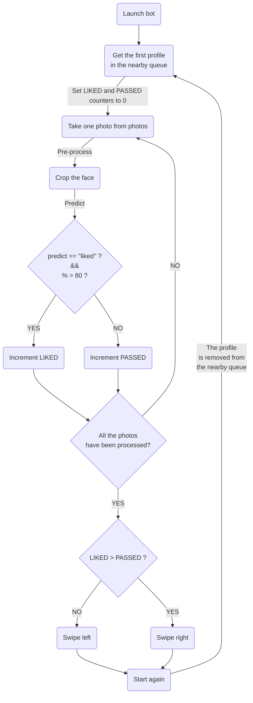

## Introduction

### Why this project? 

I first think about this idea when I was studying #artificial-intelligence in a bootcamp. We had to do a final project of our choice to apply what we learned and to face real case. We joked about this project with some classmates, based on the fact that dating apps are boring and that it could be fun to automate it and much funnier to do than doing those image classification exercices of dogs and cats found everywhere on the web. 

I finally didn't make it during the bootcamp, mostly because I had only two weeks to make this and my IA and programming knowledge wasn't very extensive but also because I didn't see myself explaining to my girlfriend at the time that I needed to install Tinder and swipe thousands of profiles to train an AI bot that will do it for me in an automated way. 😂

Recently, I wanted to increase my skills on AI, especially on computer vision, deep learning and learn more on convolutional neural network, so I decided to unearth this project and take the opportunity to write an article on my [digital garden](Digital%20garden.md) about the process of making an AI like this.

### Does it work? - Disclaimer
I told a friend of mine that I succeed creating a Tinder bot. The first questions I get was obviously: does it work? Is this worth it? 

TL;DR: Yes, it works, but if we consider this in a dating view only, no it absolutely not worth the time spend creating it. 

Creating the bot needed a lot of time, and not just coding time. The worst thing was constituting the dataset, labelling and pre-processing the images. This only, took me more than 1 week labelling photos 2 hours per day and nights of computing power to pre-process the images to end up having not enough photos to make an accurate bot. And this is not taking in account the hours of researching, coding, debugging, training multiple models and create accounts (this was predictable, but my account has been banned very early in the process). 

So **if you read this article with the idea of making it only to have more matches**, you'll better have to open the app a swipe by hand, you'll save sooooo much time,  have way better results and keep your account running.

That said, it was very fun to do, I learned a lot of things doing this project and have now a better understanding of AI, especialy on how not trivial is it to make AI. I also gain skills in reverse engineering, APIs and even [Raspberry Pi](Raspberry%20Pi.md). 

### What are we going to talk about?
Not dating for sure. Here's the summary:
- [The plan -> Using AI to simulate your taste](#The%20plan%20Using%20AI%20to%20simulate%20your%20taste)
- [Reverse engineering the Tinder API](#Reverse%20engineering%20the%20Tinder%20API)
	- [Analyzing requests with the browser](#Analyzing%20requests%20with%20the%20browser)
	- [Test the endpoint](#Test%20the%20endpoint)
	- [Find the like and pass endpoints](#Find%20the%20like%20and%20pass%20endpoints)
	- [Writing the wrapper](#Writing%20the%20wrapper)
- [Building the AI](#Building%20the%20AI)
- [Labelling images](#Labelling%20images)
	- [Creating the Tinder Bot Trainer App](#Creating%20the%20Tinder%20Bot%20Trainer%20App)
	- [Choosing the photos](#Choosing%20the%20photos)
- [Pre-processing images](#Pre-processing%20images)
	- [Downloading the images from each URL](#Downloading%20the%20images%20from%20each%20URL)
	- [Croping the faces](#Croping%20the%20faces)
- [Training the model](#Training%20the%20model)
	- [Libraries](#Libraries)
	- [Creating the dataset](#Creating%20the%20dataset)
	- [Perform data normalization and augmentation](#Perform%20data%20normalization%20and%20augmentation)
	- [Create and train the model using a convolutional neural network](#Create%20and%20train%20the%20model%20using%20a%20convolutional%20neural%20network)
	- [Import the saved model to predict the likeliness](#Import%20the%20saved%20model%20to%20predict%20the%20likeliness)
- [Create the bot](#Create%20the%20bot)
	- [Run the bot with a micro service architecture](#Run%20the%20bot%20with%20a%20micro%20service%20architecture)
- [Going further](#Going%20further)
	- [Improve the dataset](#Improve%20the%20dataset)
	- [Fill the dataset using GAN generated images](#Fill%20the%20dataset%20using%20GAN%20generated%20images)
	- [Improve the algorithm](#Improve%20the%20algorithm)
	- [Use additionals params to decide](#Use%20additionals%20params%20to%20decide)
	- [Detect surrounding elements and background in photos](#Detect%20surrounding%20elements%20and%20background%20in%20photos)
	- [Parse the bio with a NLP algorithm](#Parse%20the%20bio%20with%20a%20NLP%20algorithm)
	- [Parse the social media profiles](#Parse%20the%20social%20media%20profiles)
	- [A B testing personal photos and bio](#A%20B%20testing%20personal%20photos%20and%20bio)
	- [Generalizing to other dating platforms](#Generalizing%20to%20other%20dating%20platforms)
	- [Creating a user interface](#Creating%20a%20user%20interface)
	- [Extract common characteristics from matches](#Extract%20common%20characteristics%20from%20matches)
	- [Use a dynamic web scrapper instead of the reversed API](#Use%20a%20dynamic%20web%20scrapper%20instead%20of%20the%20reversed%20API)
- [Resources](#Resources)
	- [Books - french and english](#Books%20-%20french%20and%20english)
	- [Articles](#Articles)
	- [Documentation](#Documentation)

## The plan -> Using AI to simulate your taste

Making a Tinder bot is easy. Scripting something that will swipe right everyone, like a Selenium script on the Tinder web app, is relatively easy, but still, don't add any value, and worst, penalize you with regard to the algorithm, so you end up having less and less reach after time. 

To have something more efficient and actually, challenging in terms of code and solution, the best way could be to have an #artificial-intelligence that could choose for you the profile to swipe right or swipe left. 

This could be done using basic #deep-learning algorithms. When you start to learn deep learning, the most popular exercices and examples are about discrimination: how a machine can tell if a specific this photo is showing a cat or a dog i.e.?

As everything is about training and classification for this kind of exercices, replacing the labels "dog" and "cat" by "people who I'm physically interested in" and "people who I'm not physically interested in" can lead to an algorithm that can output a probability of "likeliness" by taking a photo as an input. 

The concept remains dead simple: 
1. You log in Tinder
2. A photo pop
3. You take this photo and use it as the input of you AI algorithm
4. The algorithm output the likelihood that you will find the person attractive
5. If this number is superior than what you estimate your confidence limit, you swipe right
6. Else, you swipe left

But in practice, there's a lot more difficulties we need to overcome in order to succeed. 

## Reverse Engineering the Tinder API

There are multiple ways to interact with online services. You can use a web-driver like Selenium to scrap the web and make programmatic actions, but you're dependent of the interface changes and some website can make it very hard to do, or you can use the service API, but not every service has its API public. And guess what? Tinder don't have it public, but still, we can guess it using and call it using various technics. 

Tinder is a mobile and web app. And like any mobile app, its backend is an API that is requested by its frontend. So when you're doing an action on Tinder, wether it's on the mobile or in the web, request are made to the suitable endpoint in order to get perform some action and returning to the frontend a JSON response that will be use to do some other actions.

To authenticate the user who's is making the request, the API need to get an authenticity token, which is a unique randomly generated string, in the request's header. 

So before making any action, we need first to figure out how the API works: 
- What is my token?
- What are the available endpoints?
- What are they responding? 

### Analyzing requests with the browser

To retro-engineer the API, we can use different technics, depending on whether or not the app has a web app. 

If it doesn't have one, we have to use a proxy with a technic called "Man in the Middle" to intercept the requests that are fired from the app. We could easily do this using [MITM Proxy for Android and iOS](https://medium.com/testvagrant/intercept-ios-android-network-calls-using-mitmproxy-4d3c94831f62) i.e.

But Tinder has a web app, so we can use the browser to analyze the requests that are made to their API to deduce how it works: 


We can already deduce some useful requests based on their method and URL. When I first see this, the one that attracted my attention is the `core?locale=en`  endpoint. 

I figured out that this is this endpoint that send the profiles to the frontend. Its JSON response contains an array of more than 15 profiles, and each are object with useful informations such as : 
- UUID
- Name
- Birthdate
- Bio
- Gender
- Facebook profile if any
- Spotify if any
- An array of interests if any
- And the most important: an array of objects called `photo`, which have an `url` attribute that can be accessed outside the app. Bingo! 


Now that we know the endpoint to get the profiles, we need to find our authenticity token to perform request on it. These tokens are always in the header, and to figure out which one is it, I always search for the one that is recurring in every request and match somewhat the term "authenticity" or "token". In Tinder, it's the  `X-Auth-Token` that is used to authenticate you to the backend. 


I learned later, throughout my experiments, that Tinder is rotating this `X-Auth-Token` every 2 or 3 days in order to make smart kids' life more difficult. I'm not sure about this, but I think that requesting an outdated `X-Auth-Token` can casualy lead to ban or shadow ban (means that the profile still exist but has no reach anymore). So it can be a good thing to start each test session with the updated `X-Auth-Token` (and obviously use a profile to which you are not attached). 

This apart, we're now ready to perform our own requests!

### Test the endpoint

To perform HTTP requests, we can use the `cURL` command, but it's a bit harsh. There are a lot of [tools](My%20productivity%20tools.md) that are more convenient with graphical interfaces that can help to better understand and test endpoint faster. I use [Insomnia](https://insomnia.rest/) for this. 

Just create a new GET request to the URL `https://api.gotinder.com/v2/recs/core`, fill the header with a pair `X-Auth-Token: your-token-here`, click Send and you should obtain a similar response to the one in the browser. 


### Find the like and pass endpoints

At the end, if we want our bot to like/unlike automatically, we will need the `like` and `pass` endpoints. 

To find those, we just make the same as before:
- Open the Request tabs in the developer tools of your browser
- Click on "Like" in the interface
- Observe the request to find something that look like what you're searching


Here, we can see that the endpoint is ending with an ID. It's easy to deduce that this is the user `_id` attribute, that we had get in the request's response to the `core` endpoint. 

The `like` and the `pass` endpoints aren't working the same way. For the `pass` it's a GET request to `https://api.gotinder.com/pass/:id?s_number=xxxxxxxxx` and for `like` it's a POST request to `https://api.gotinder.com/like/:id` with `s_number` as a param. I admit not knowing the purpose of this `s_number` params, but can tell that it's a 9 digit integer, different for every request. But still, the `like` endpoint also work using a GET request and for both, we can avoid this `s_number` parameter.

When we fire a request to the `like` endpoint, we get a JSON response with the remaining likes (when in free acount it's decrementing until it reach 0) and with a `match` flag.

We have all of our endpoints now! 

### Writing the wrapper

With these, we can now write an API wrapper to call the endpoints in our application. I made mine with Ruby, my favorite programming language, but you can use any other language for this. 

```ruby
class TinderClient
  
  URL = "https://api.gotinder.com"
  
  def nearby_persons
    endpoint = "/v2/recs/core"
    get(URL + endpoint)
  end
  
  def like(user_id)
    endpoint = "/like/#{user_id}"
    get(URL + endpoint)
  end
  
  def pass(user_id)
    endpoint = "/pass/#{user_id}"
    get(URL + endpoint)
  end
  
  private
   
  def headers
    {
      "X-Auth-Token": ENV["tinder_x_auth_token"],
      "Content-Type": "application/json",
    }
  end

  def get(url)
    RestClient.get(url, headers)
  end
  
end
```

We're ready to perform our own request on the Tinder API, let's now create the AI part algorithm. 

## Building the AI

Before starting to actually build the AI, let's have a bit of theory to understand better what we would have to do in order to make this work. 

Our goal is to classify image of people into two different categories: `attractive` and `not_attractive`. 

We will have to use a specific class of deep neural networks, called a Convolutional Neural Network (CNN, or ConvNet) that will first learn from already labeled images and extract common characteristics and patterns and use it to predict the likeliness to one of these two different categories. 

Thus we will have to create a hand labeled set of images that we will use to train our CNN. The larger the set is, better the predictions are. To have something significant, we need to at least target 5,000 images in total : 2,500 `attractive` and 2,500 `not_attractive`. Which is a lot! 

Once we have these images, we need to pre-process it to remove all the noise. The noise here, is all the thing that is not the person her/himself: landscapes, friends, animals, memes... We will loop through each image, detect the face and crop the image to only have the face. 

This pre-processing algorithm will be reused when playing our bot to pre-process each image before trying to predict the % of likeliness. 

After having all the images labeled and processed, we will be able to train our CNN and create a service with it that we can call each time we have a new photo to test. 

## Labelling images

To get 5000 images hand labeled images, *-at least-*, we need an efficient strategy. We also need to keep in mind that the algorithm will reflect our own preferences, it will be highly subjective. 

Usually, a data-scientist making a new AI algorithm will search for datasets of already labeled or even pre-processed data. You could take only [the woman folder in datasets used of gender classification](https://www.kaggle.com/cashutosh/gender-classification-dataset), but the aim of this kind of dataset is to remain highly objective and diverse in order to recognize as much faces as possible. That's not what we want. 

We don't have any other solutions than making it by hand. To achieve this faster, we can create a copy-cat app of Tinder, that will interact with the real Tinder API, but that will allow you to store the photos of the people you find attractive. After creating this, you'll need just to swipe as much as possible until you reach a significant amount of data. 

### Creating the Tinder Bot Trainer App


Now that we created our API wrapper, we can use it to recreate the interface of a Tinder like. I used a basic Ruby on Rails stack, with HTML, CSS, PostgreSQL and Heroku (so I can train the bot in the subway on my phone). 

The app has just a few features :
- A swiping page that pull the profiles from the `/core` endpoint.
- For each profile I can either swipe left or right using the `/like` and `/pass` endpoints.
- More important, I can like/pass on each photo separately to carefully choose in one profile the photos that I like or pass.
- When I like/pass a photo, it record the `image_url` in the database with the appropriate label. 

This will look like this (*I changed the real photos by kittens in order to protect privacy)*:  


Here's the controller code to better understand what's going on here : 

```ruby
class PhotosController < ApplicationController
  
  # Getting the first profile in the "nearby person" queue
  def index
    json_object = JSON.parse(TinderApi.new.nearby_persons, object_class: OpenStruct)
    @tinder_profile = json_object.data.results.first
  end

  def create
    @photo = Photo.new(photo_params)
    
    if @photo.save!
      respond_to do |format|
        format.json { head :ok }
      end
    end
  end
  
  def swipe_right
    client = TinderApi.new
    response = client.like(params[:tinder_id], params[:s_number])
    
    if response.code == 200
      redirect_to photos_path
      flash[:success] = "Swipe right :-)"
    else
      redirect_to photos_path
      flash[:danger] = response
    end
  end
  
  def swipe_left
    client = TinderApi.new
    response = client.dislike(params[:tinder_id])
    
    if response.code == 200
      redirect_to photos_path
      flash[:success] = "Swipe left :-("
    else
      redirect_to photos_path
      flash[:danger] = response
    end
  end

  private
  
  def photo_params
    params.require(:photo).permit(:url, :label, :user_id)
  end

end

```


### Choosing the photos

To maximize the algorithm efficiency, we need to keep in mind that we're training an AI most than we're just swiping attractive people. When the algorithm will auto play, it'll need to differentiate a lot of different case, and not everybody on Tinder puts photos that can feed this kind of algorithm. And mostly, the algorithm will reflect your choice: if you have 2000 photos of people with sunglasses, it will perform only on photos that depict people with sunglasses. 

To make it the more no-brainer, here's the liking policy I set to myself about what the photo should or shouldn't be:
- Not be a meme, artwork, prompt or anything like this
- No mask or Snapchat filter
- The main character isn't an animal
- The person is highly recognizable, no back or hidden profile photo, or photo edit. 
- No group photo (unless you find every people attractive) because the pre-processor will take into account everyone 
- The person isn't too far or too close
- Not too much or not enough exposure
- Not too much liked photo with sunglasses
- I find the person attractive (evidently)

If a photo doesn't match this policy, I set it as `pass`, else, as `like`. 

Having those 2500 photos on each label is more difficult than it seems. After swiping a lot of photo, I notice that there's not that much photo to pass, so I hardened the policy for this in order to faster reach the threshold. 

You can also speed up the process on both categories by manualy adding photos in the folder: celebrities you find attractive in the like folder and noisy photos in the pass folder.

## Pre-processing images


We now have our images. But it's still not enough for our algorithm. We now need to pre-process it. 

The pre-processing is a step in artificial intelligence where you clean up all the data in order to maximize the algorithm's performances. In computer vision, it's often removing the noise of each photo by croping it, changing resolution to make the learning process a little faster etc. 

### Downloading the images from each URL

As we stored our labeled images in our database as Aa URL, we need to now download each photos. 

This process takes time and resources, so I loaded the database on my [Raspberry Pi](Raspberry%20Pi.md) to avoid cluttering my main computer with this. 

Once the database was loaded on the Raspberry Pi, I wrote a little script to download each photo and put it in the appropriate folder:

```ruby
require 'open-uri'

class PhotoDownloader

  PATH_PASSED = Rails.root.join("public/passed")
  PATH_LIKED = Rails.root.join("public/liked")


  def initialize
    @photos = Photo.all
  end
  
  def download_photos
    downloaded = 0
    rescued = 0
    start_time = Time.now
    
    @photos.each do |photo|
      path = photo.liked? ? PATH_LIKED : PATH_PASSED
      begin
        read_image = open(photo.url).read
        File.open(path + "#{photo.id}.jpeg", "wb") do |file|
          puts "downloading #{photo.url}..."
          file.write read_image
          downloaded += 1
        end
      rescue => e
        puts "RESCUE #{e}"
        rescued += 1
        next
      end
    end
    
    end_time = Time.now
    puts "================"
    puts "Downloaded : #{downloaded}"
    puts "Rescued : #{rescued}"
    puts "Elapsed : #{end_time - start_time} seconds"
    puts "================"
  end

end
```

I had something like 7,500 photos to download, it took a night and more than 5GB of storage. I also notice the importance of having more photos than what we need because between the time I started labelling the photos and the time I launch this scripts, some photos and profiles had been deleted by their owners and remained unreachable, hence the `rescue` close. It's easy 5% of the dataset. 

Before going through the other process, I also compressed all the photos to 1024px in order to have faster computing when going through the next algorithm. Sometimes, you get like 10MB photos, which can require a lot of computing power that isn't necessary.

### Croping the faces

We're now entering in the AI algorithm part. With a total of ~7,000 photos, we can't crop each one by hand. So we need to use a specific algorithm to crop each face in each photo for each folder... (Big loop here!) 

When searching for face recognition algorithms, I find [DeepStack AI Server](https://deepstack.cc/) that can make the job for us. It's a server API that you run on lots of plateform : macOS, Ubuntu, Docker, and even [Raspberry Pi](https://docs.deepstack.cc/raspberry-pi/index.html) with the [Intel Neural Compute Stick 2](https://www.hackster.io/news/getting-started-with-the-intel-neural-compute-stick-2-and-the-raspberry-pi-6904ccfe963). It works either on CPU or GPU for faster computing. 

DeepStack AI Server will provide various endpoints: face/object or scene recognition, detection and match with each other endpoint. The one that is interesting for us is the [Face Extraction endpoint](https://deepstack.cc/face-recognition/index.html#extracting-faces). 

This is the same technic that we will need to use to pre-process the images on the go when the bot will be running alone. It's important to make it as an independent service to gain in agility. 

It was the opportunity for me to also start using [Docker](https://www.docker.com/). DeepStack installation needs to be made with Docker on MacOS. It consists as a Docker image that you run on the port `80`. Once everything is running smoothly, we will be able to perform request against the `http://localhost:80/v1/vision/face` endpoint to extract our faces. 

As all the example were in Python, I didn't created the script using Ruby (I think it can be done with Ruby, but it will be long and somewhat inefficient I think): 
```python
# extractor.py
import requests
from PIL import Image
import pdb
import os
  
def face_extraction(path, original_filename, export_folder):
  image_data = open(path,"rb").read()
  image = Image.open(path).convert("RGB")

  response = requests.post("http://localhost:80/v1/vision/face",files={"image":image_data}).json()
  i = 0
  
  for face in response["predictions"]:
      y_max = int(face["y_max"])
      y_min = int(face["y_min"])
      x_max = int(face["x_max"])
      x_min = int(face["x_min"])
      cropped = image.crop((x_min,y_min,x_max,y_max))
      filename = "croped-{}".format(original_filename)
      cropped.save(export_folder + filename)
      i += 1
      return filename
      
if __name__ == "__main__":
  liked_directory = "data/train/liked/"
  passed_directory = "data/train/passed/"
  
  for filename in os.listdir(liked_directory):
    if filename.endswith(".jpeg"):
      face_extraction(liked_directory + filename, filename, "data/croped/liked/")
      continue
    else:
      continue
    
  print("finish")
    
```

The script is basic, nothing magic here:
1. I loop through the files in the `liked_directory`
2. For each `.jpg` file, pass it to the `face_extraction()` method
3. The method will request DeepStack API in order to get the predicted coordinates of the cropped face
4. I use this coordinates to crop the image using the `Image.crop` method 
5. Then save the image in the output folder. 

We now have our pre-processing algorithm working! 

## Training the model

Once we pre-processed all the images and separated it within two distinct folders, we can now start creating our prediction model. 

### Libraries
We will use TensorFlow, a deep learning library made by Google to create an image classification model, Matplotlib and Numpy, which are common machine learning libraries to create datasets and manipulate numbers.

```python
# train_model.py
import matplotlib.pyplot as plt
import numpy as np
import os
import PIL
import tensorflow as tf

from tensorflow import keras
from tensorflow.keras import layers
from tensorflow.keras.models import Sequential
import pathlib
```

### Creating the dataset
The first thing we need to do, is to create two different datasets from our image folder. The `train_ds` is the dataset from which the model will learn and the `val_ds` the one that will validate the prediction of the model. By going back and forth from these two datasets, the model will learn himself the characteristics that classify a photo as `liked` or `passed`. 

TensorFlow example also provides a way to improve the performances of each dataset by caching elements. 

```python
# train_model.py
# Create the dataset
batch_size = 32
img_height = 180
img_width = 180
data_dir = "data/croped/"

train_ds = tf.keras.preprocessing.image_dataset_from_directory(
  data_dir,
  validation_split=0.2,
  subset="training",
  seed=123,
  image_size=(img_height, img_width),
  batch_size=batch_size)

val_ds = tf.keras.preprocessing.image_dataset_from_directory(
  data_dir,
  validation_split=0.2,
  subset="validation",
  seed=123,
  image_size=(img_height, img_width),
  batch_size=batch_size)

class_names = train_ds.class_names
print(class_names)

# Configuring the dataset for performances
AUTOTUNE = tf.data.AUTOTUNE

train_ds = train_ds.cache().shuffle(1000).prefetch(buffer_size=AUTOTUNE)
val_ds = val_ds.cache().prefetch(buffer_size=AUTOTUNE)
```

### Perform data normalization and augmentation
Once we have our datasets, and before creating the model, we have to perform a new kind of pre-processing on the dataset. The first will be a normalization, which means that we are making all images at the same scale to feed the model with the same kind of data everytime. 

To improve the model's prediction accuracy, we can also make a data augmentation. As we don't have that much data (even if 7,500 photos feel like a lot, it's still not enough to predict with high accuracy), this is something that we will prefer to do. The data augmentation process is simple: it output eight new images from one by applying random (but realistic) transformations to each and increase the diversity of the training set.  By using this, we're augmenting our dataset from 7,500 to 60,000 photos. The training will be longer of course, but the result will be better. 

```python
# train_model.py
# Standardize the data
normalization_layer = layers.experimental.preprocessing.Rescaling(1./255)

normalized_ds = train_ds.map(lambda x, y: (normalization_layer(x), y))
image_batch, labels_batch = next(iter(normalized_ds))
first_image = image_batch[0]
# Notice the pixels values are now in `[0,1]`.
print(np.min(first_image), np.max(first_image))

# Data augmentation
data_augmentation = keras.Sequential(
  [
    layers.experimental.preprocessing.RandomFlip("horizontal", input_shape=(img_height, img_width,3)),
    layers.experimental.preprocessing.RandomRotation(0.1),
    layers.experimental.preprocessing.RandomZoom(0.1),
  ]
)
```

### Create and train the model using a convolutional neural network
We're now ready to create our model using a 15 layer convolutional neural network. I'm not a big expert of CNNs, but what I understand is that each image will going through each of these layers, each using a different algorithm, to return different 4D tensors and tuning the model in order to output the prediction we need. 

Adding new layers can make the model more accurate but will also slow the training process that is already taking more than 20 minutes. Same for increasing or decreasing the number of epochs which is a hyperparameter of gradient descent that controls the number of complete passes through the training dataset. 

On my MacBookPro 2016, with 2,7GHz i7 CPU, each epoch is about 90 second long. So we wait patiently that the model is finish. To avoid passing through the training each time we need to predict something, we can save the model in the directory using the `model.save()` method. We will then import this model to make our predictions and thus save a precious time. 

```python
# train_model.py
# Create the model
num_classes = 5

model = Sequential([
  data_augmentation,
  layers.experimental.preprocessing.Rescaling(1./255),
  layers.Conv2D(16, 3, padding='same', activation='relu'),
  layers.MaxPooling2D(),
  layers.Conv2D(32, 3, padding='same', activation='relu'),
  layers.MaxPooling2D(),
  layers.Conv2D(64, 3, padding='same', activation='relu'),
  layers.MaxPooling2D(),
  layers.Dropout(0.2),
  layers.Flatten(),
  layers.Dense(128, activation='relu'),
  layers.Dense(num_classes)
])

# Compile and train the model
model.compile(optimizer='adam',
              loss=tf.keras.losses.SparseCategoricalCrossentropy(from_logits=True),
              metrics=['accuracy'])

model.summary()

# Train
epochs = 15
history = model.fit(
  train_ds,
  validation_data=val_ds,
  epochs=epochs
)

# Save model 
model.save('saved_model/tinder_bot_model')
```

### Import the saved model to predict the likeliness
Once our model is saved, we can now import it to predict if an image is more likely to going in the `liked` category or the `passed` category. 

Having a model to import is a real-time saver but it's also essential if we want to bring our machine learning model in production and run it on other less performant machines that can't recreate the model each time. 

By creating it in a separate file, it will be easier to use it from the outside. Our method just needs an `image_path` argument and will output the prediction.

```python
# predict.py
import numpy as np
import PIL
import tensorflow as tf
from tensorflow import keras
from tensorflow.keras import layers
from tensorflow.keras.models import Sequential


def predict(image_path):
	img_height = 180
	img_width = 180
	class_names = ["liked", "passed"]

	# Charge the saved model
	model = tf.keras.models.load_model('saved_model/my_model')
	model.summary()

	image_url = tf.keras.utils.get_file('test_file', origin=image_path)

	img = keras.preprocessing.image.load_img(
		scarlett_url, target_size=(img_height, img_width)
	)
	img_array = keras.preprocessing.image.img_to_array(img)
	img_array = tf.expand_dims(img_array, 0) # Create a batch

	predictions = model.predict(img_array)
	score = tf.nn.softmax(predictions[0])

	print(
		"This image most likely belongs to {} with a {:.2f} percent confidence."
		.format(class_names[np.argmax(score)], 100 * np.max(score))
	)

predict("test_images/scarlett_johanson.jpg")
```

I used a photo of Scarlett Johanson to test the algorithm accuracy, and I get : 
```
This image most likely belongs to liked with a 91.97 percent confidence.
```

This mean that, if my bot meets Scarlett Johanson's profile on Tinder, it will swipe her right. 😄

## Create the bot 

Now that we have all of our components in separated services, we can wrap up everything and get that Tinder AI Bot. 

The way we will get everything working together is pretty simple, so let's make flow-chart:



Let's explain a bit here. To work, the bot just needs to process the images one by one. Theses images are in the Tinder profile JSON respond when pulling profiles from the `/core` endpoint. 

The process that will take a bit of time is of course the pre-process and predict phase for each photo. To crop the faces in a photo, we will need to download the image in our local folder (or on a storage service like AWS S3 if we're putting the bot in production) and feed DeepStack with it to then save the cropped file in another folder. 

Then, we input the cropped file to our machine learning model to get the prediction : is it a `liked` or a `passed`, and which % of confidence it is? 

It's important to take into account the % of confidence in our decision to avoid false positive predictions (see confusion matrix). We can lower this threshold to have a softer algorithm and have more liked profiles. 

In a profile, it's frequent that not every photo are valid/attractive. To better reflect this, we can increment counters on the go to make a simple comparaison at the end and decide to swipe left or right based on the number of liked photos in the current profile. 

So if we have more `liked` count than `passed`, we can swipe right this profile and start the loop again. ♻️


### Run the bot with a micro service architecture

As we made this using Ruby, Python with TensorFlow and DeepStack AI, we need to  use everything as a micro service architecture where each service is an API with its own set of endpoints. 

Putting everything online will require multiple server instances as well as static assets storages. It's way more complicated and can cost money. So instead, I advise to make locally, using multiple terminal windows. 

To APIfy our machine learning model, we can use Flask for Python and run the API on `http://localhost:8888` just one endpoint : `predict(photo_path)` that will call the  `crop(photo_path)` from DeepStack Server on the port `http://localhost:80` in order to get the cropped faces that will be used to get the prediction. 

This can be orchestrated by a Ruby script that use the `TinderClient` wrapper we made before. 

That's it, our bot can go live! 🚀

## Going further 

Even if this seems pretty advanced, it is still not very accurate. I'm not a machine learning engineer, so there's a lot of things that surely can be improved in order to make the bot more performant. Here's some clue:

### Improve the dataset
I think that having a bigger and more balanced dataset could drastically improve the prediction accuracy. With this algorithm and this dataset, I still get some hazardous results on some photos. When watching at the online datasets, there's all very well balanced and far bigger. Improving the dataset can take a lot of time and need a lot of swiping, but will be responsible of huge improvement. Everyone to choose! 

### Fill the dataset using GAN generated images
Generative Adversarial Networks (GANs) are type of neural network architecture for generative modeling. Services like https://thispersondoesnotexist.com/ are using this kind of neural network to generate fake but really natural portraits. With an opinionated dataset, a GAN could generate new faces that could make the dataset bigger and more diverse. 

### Improve the algorithm
As I said before, I'm not a machine learning engineer, so the algorithm here is more a "smart copy/paste" from TensorFlow tutorials than a real opinionated and measured algorithm. As I don't master what's inside the CNN, I can't really tweak the different layers in order to have better result. This would need more research and learning but will definitely leads to a better understanding of the algorithm. 

### Use additionals params to decide
We could take the other available parameters such as the birth date and the interests as our scoring components. This wouldn't need machine learning at all, but can help to make better decisions.

### Detect surrounding elements and background in photos
It's common that people put photos of themselves doing what they love, like traveling, going to the beach, playing the guitar, cooking, drinking bear... We could push farther the CNN to also detect surrounding elements and use it in the scoring system. I.e: you like musicians, so you attribute a better score to the profile if the algorithm detects the presence of a music instrument. This kind of algorithm is easy to implement and widely use by Facebook (and others) to auto label images for accessibility. 

### Parse the bio with a NLP algorithm
The bio is a param that have a significant influence on choosing wether to swipe right or left a certain profile. Using natural language processing (NLP) algorithms to perform analysis on the bio, we could extract some useful information for this choice. As not everyone write a bio, it can be a lot of work for a small result, but still a challenging feature to add. 

### Parse the social media profiles
Some profiles sync their Instagram and/or Spotify account with Tinder. The links are available in the JSON profile, so we could imagine having specific algorithms that parse each profile in search of interesting characteristics that could lead to additionals scoring components. This will require looking at the other services with each their own specificities but still can be a good challenge. 

### A/B testing personal photos and bio
Even the most powerful bot could not have you more matches if your profile isn't optimized too. I didn't talk about this in the reverse engineering process, but there's also a lot of endpoints available in the profile edit section, also endpoints for premium features such as incognito mode and travel. Using these, we could perform A/B tests by regularly updating bio, interests, photos and measure the impact of each new test by watching matches. 

### Generalizing to other dating platforms
What's really time consuming here, is gathering and labelling the photos to constitute the dataset. But this is absolutely independent from how Tinder works. Reverse engineering APIs when the service has a web app is matter of few hours when you know what to search for. Creating multiple APIs wrapper for each app and adapting the code to run on separate (even more ambitions, on simultaneous) dating apps could improve the chance of having matches. 

### Creating a user interface
This bot has still been living in the terminal so far. Which isn't very convenient for non-tech people. Creating an interface that can hide all this complexity and allow a user to connect his/her own profile could even lead to business services and improve the model accuracy thanks to more people swiping. 

### Extract common characteristics from matches
As the goal is in the end to get more matches, choosing to swipe right the profiles which shares characteristics with profiles we already matched with can be a great option to explore in order to rise up the matching probability. 

### Use a dynamic web scrapper instead of the reversed API
I think it'll be better to use a dynamic web scrapper such as Selenium to perform actions on the web page rather than using the reversed API. There's a lot of little details I don't get on the requests and think that some params are randomly generated and passed to the server in order to better authenticates fraud. And this result in shadow ban or real ban. By testing a lot of things, I had one profile baned and another that sees its reach reduce to nothing (0 matches for more than 7,000 profiles swipped... I'm not that ugly! 😂&nbsp;). Using Selenium right into the web browser could help reduce risks, unless Tinder implemented entropy-based anomaly detection methods to ban bot account. This will also end the need of rotating the `X-Auth-Token`. 

## Resources
### Books - french and english
- [L’intelligence Artificielle, Pas Sans Elle !  - Ause Bernheim, Flora Bernheim ](L’intelligence%20Artificielle,%20Pas%20Sans%20Elle%20!%20%20-%20Ause%20Bernheim,%20Flora%20Bernheim%20.md)
- [Les Avancées De L’intelligence Artificielle  - Olivier Ezratti](Les%20Avancées%20De%20L’intelligence%20Artificielle%20%20-%20Olivier%20Ezratti.md)
- [Quand La Machine Apprends - La Révolution Des Neurones Artificiels Et De L'apprentissage Profond - Yann Le Cun](Quand%20La%20Machine%20Apprends%20-%20La%20R%C3%A9volution%20Des%20Neurones%20Artificiels%20Et%20De%20L'apprentissage%20Profond%20-%20Yann%20Le%20Cun.md)
- [Le Mythe De La Singularité, Faut Il Craindre L’intelligence Artificielle ? - Jean Gabriel Ganascia](Le%20Mythe%20De%20La%20Singularité,%20Faut%20Il%20Craindre%20L’intelligence%20Artificielle%20?%20-%20Jean%20Gabriel%20Ganascia.md)
- [Intelligence, Machines Et Mathématiques - L'intelligence Artificielle Et Ses Enjeux n°29 - Ignasi Belda](Intelligence,%20Machines%20Et%20Mathématiques%20-%20L'intelligence%20Artificielle%20Et%20Ses%20Enjeux%20n°29%20-%20Ignasi%20Belda.md)
- [The Artist In The Machine - Arthur I. Miller](The%20Artist%20In%20The%20Machine%20-%20Arthur%20I.%20Miller.md)
- #books/artificial-intelligence 

### Articles
The Tinder bot isn't something new, thanks to those who made articles about that, these helped and inspired me a lot, especially on the machine learning part.
- [Exploiting Tinder to get paid features for free : Reverse engineering Tinder API - softwareontheroad.com](https://softwareontheroad.com/reversing-tinder-api-with-nodejs/)
- [How I automated Tinder using artificial intelligence - Oscar Alsing](https://medium.com/breathe-publication/how-i-automated-tinder-using-artificial-intelligence-bba45c59dae0)
- [How I used artificial intelligence to automate Tinder - Jeffrey Li](https://towardsdatascience.com/m2m-day-89-how-i-used-artificial-intelligence-to-automate-tinder-ced91b947e53)
- [How to do image classification on custom dataset using TensorFlow](https://www.codementor.io/@aryanpegwar/how-to-do-image-classification-on-custom-dataset-using-tensorflow-156whbiy5t)

### Documentation
- [Image recognition - TensorFlow](https://www.tensorflow.org/tutorials/images/classification)
- [Extracting faces - DeepStack](https://deepstack.cc/face-recognition/index.html#extracting-faces)