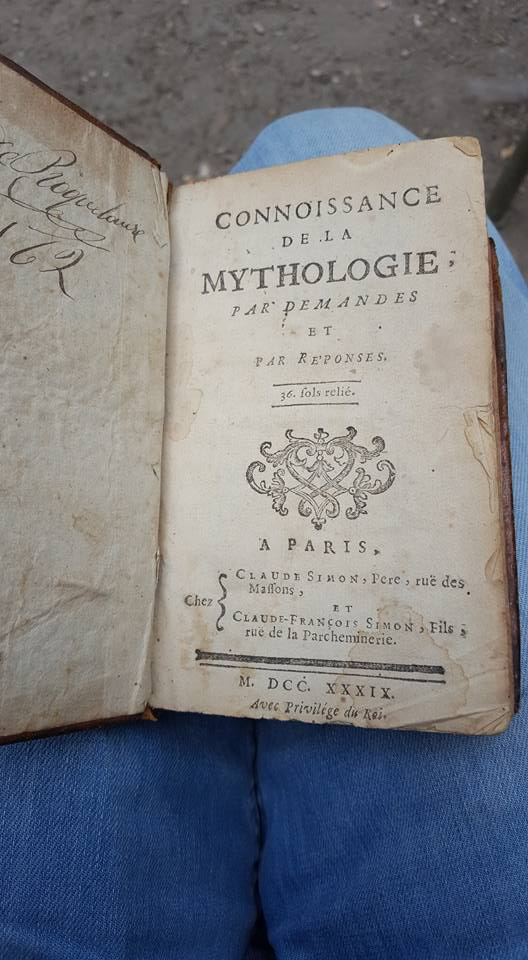
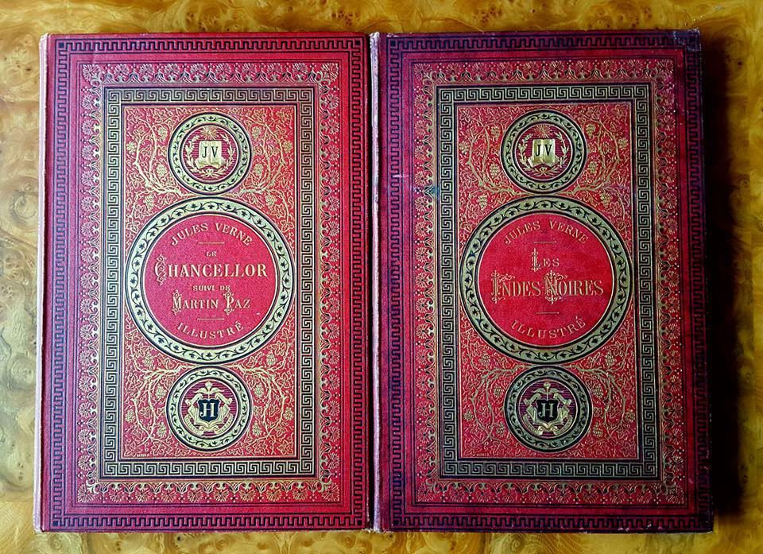
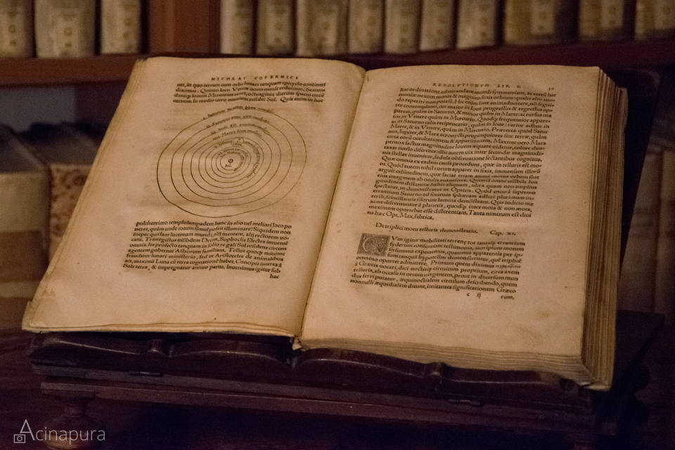

# Collecting old books

## How I started collecting old books

I started collecting old books in summer 2016. The story behind how I started can seem a bit mystic : I met a crazy old guy in the street of Paris at night in front of an old bookshop who transmit me his passion.

> Old guy coming from no where with a plate of eggs in his hand : Oh, sorry, you were waiting me? My bad!
>
> Me: Not at all, I was just watching theses books, they seems awesome and I'm curious.
>
> Old guy: -opens the door of the library- Alright, you're curious hum? Come here, I'll show you some!

It appears that this old crazy guy, with the plate of eggs \(it was around 9pm\) he got from the restaurant beside, was the owner of this old bookshop.

I came into the shop and see theses big libraries, filled with all leather books that seemed to came right from the XVII century. He started to ask me what were the thing that fascinate me.

Any subject I was talking about, he had a book from another century about it. Whether it's music, architecture, mythology, medicine, history, in French, in English, in Hebrew, in Arabic... And as I far as I was listening to him talk, I can say that he knew every single of his books.

Anytime we were discussing a subject, he'd go searching in the shop a book about it and gave it to me.

> Old guy: This one is from 1765, see how it is still clean. I loved how the author talk about -_start talking about very specific details with so much passion_-
>
> Me: _Watching the price and the release date of the book and think : Is this guy just letting me read a 1000€ book that is about 300 years old? 😵_

No need to say that I was very precious with it. I felt like I was carrying history in my hand. What a feeling!

He talked about crazy things and learned to me various things about old books during more than an hour and didn't ask for any money or never urge me to buy something. A crazy night!

I came back to his library a month or two later to buy my first old book with the only euros I had this time. The irony, is that he didn't remember me at all. 😅

I bought a book from 1756 entitled "Connoi∫∫ance de la mythologie par demandes et réponses" \(can be translated as : Knowledge about mythology by questions and answers\). I bought it way too high for its condition and I can totally say that I was screwed but anyway, the guy was kind, and he sparked into me the interest of collecting old books.

## What "old book" means

There is a large variety of classification in the book world. An "old book", stricto sensu, is a book that was release before 1850. This is different from what we can call "collector books", which are books that are created specially for book collectors. So an old book can also be a collector book.

Another very widespread term is "rare book" that take in "old books" and "collector books" with no distinction of period.

We can recognize an old book just by his binding and his paper. The most widespread bindings in the world of old books are the ones with brown leather that usually date the book to the XVIII century.

## Why people collect old books

I think there is as much reason as collectors but here are some reasons you might like and consider collecting old books :

* You like history : Old books are fragments of history, so you'll be interested in owning your own piece of it. Buying oldies is an easy and cheap way to achieve this. 
* You like books as manufactured objects : Old books are very good artisanal pieces. They are often crafted by hand and carry a charm that modern book can't have anymore. 
* You want to learn about specific subjects from the past \(or still up to date though\) : If you want to learn about specific medication, botanic, constructions, engineering, `array_of_subjects.sample` forgotten technics, well, old books are awesome for this. 
* You want to go very deep about a specific field : Lets imagine you study electricity : you can find a lot of how electricity came to the version it is today by starting to buy old books about this subject. E.g : I have a book about submarines navigation and engineering from 1906. It is awesome to see what they were into at this time, what they were trying to achieve and what was their technology advancement. I figured out that submarines are way older than I was thinking.
* You like a specific author : E.g, I'm crazy about Jules Verne, and I'm collecting "Hetzel's cardboard", which are the editions printed during Jules Verne lifetime. They're well known for the quality of the drawing on it. If you're into a specific author, whether it's Shakespeare or Hemingway or any other, you'll discover them again by collecting their old books as the content had evolve across new editions and get closer to their roughest ideas. 
* You want to invest money in a tangible asset that both look good and has an increasing value : because yes, old books, just like wine, are taking value across time. It's an asset that need to be seen as long-term investment \(or short term if you're digging books from people who don't know what they're giving/selling\) and can be great for diversification if you're careful with it. 

Obviously, the most widespread reason is simply the passion of books. Like any collection, it all start with passion.

## Where to buy old books

Rare books can be bought in various places, both offline and online. Here's the most popular :

* Old books stores, like the one I was talking about at the beginning. I think this is the best place as you can really take advantage of the seller's expertise and know more about the books you're going to buy. Also, it's a great place to learn about collecting strategies. And you can create a relation with the seller, ask him to be notified for specific subjects or even negotiate the prices \(very common practice in this place\) :-\). 
* [eBay](https://www.ebay.fr/b/Livres-anciens-et-de-collection/29223/bn_16575447). This is the most used online place for buying and selling rare/old books. There is a lot of auctions and beginners can have a chance to get great books if they're commit enough.
* Exhibitions. In France, we have a lot of exhibitions on rare books, mostly in Paris. Depending on the exhibitions, you'll find less or more expansive books. E.g : at the Saint Sulpice outdoor old book market, you'll find very affordable books. I get something like 5 to 6 great condition books for less than 50€. But if you go to the "Rare book and art object exhibition" at Le Grand Palais, you'll find very expansive books \(this is where I saw the one from Copernicus at 250 000€ I'm talking below\). This is where professional and well known collectors buy their most precious books.
* On specific website such as [Livre Rare Book](https://www.livre-rare-book.com/), [Abebooks](https://www.abebooks.com/) or [Alibris](https://www.alibris.com/books/rare-collectible). These websites are also places where you can find information about specific editions, prices and find bookshop stocks.
* Auctions. Whether it's on eBay or prestigious auction houses like [Sotheby's](https://www.sothebys.com/en/departments/books-manuscripts) or [Drouot](https://www.drouot.com/), you can do great deals on auctions if you trained your eye enough.
* By getting rid of people books. Sometimes, people have books in their house and don't know what to do with it. You can sometimes find pretty valuable books. But just don't be a dreamer : 95% of the time, it's like 20€ books at the best. 

What I like to do is book safaris : each time I'm going to a new city, I search for a book store and come back home with new old books. I have the [Livre Rare Book app](https://play.google.com/store/apps/details?id=com.lrb.android.lrb) that list on a map the rare book stores and events around you. Pretty useful!

## Pricing an old book

Just like other collections, books can go from 0€ to millions! The cost depends on many variables :

* The condition : Greater the condition is, higher the price
* The year : Older the book, higher the price
* The edition : First editions are the most expansive books
* The subject : Some subjects attract more than other, so it tends to drive up the price of the books
* The author : Some authors are known as more valuable. Jules Verne is one of them. But it also can be a trend : Victor Hugo after the burning of Notre Dame seen his books value go way too high
* The binding : There're many bindings technics, especially in leather. Sow skin or vellum \(stillborn calf skin\), for example, tend to be more expansive
* The presence and the kind of graphics : Just like the binding, there're many graphic technics. Medieval illumination graphic technic is one of the most expansive one for books. Engravings are more popular so can be cheaper. 
* The history of the book : I once see the 2nd edition of _De Revolutionibus orbium coelestium_ from Nicolas Copernicus \(1530\) at the Grand Palais' exhbition. This is the book where Nicolas Copernicus expose his theory about heliocentrism. The book was to sell for 250 000€. And watch out: It was just a 2nd edition!
* The presence of a signatures or annotations : If the book is signed by the author himself, it can reach very high prices. Margin annotations can also be a price factor, depending on what and who wrote them, the price can rise or fall. 

By the way, the most expansive book of all time is [Leonardo da Vinci' notebook "Codex Leicester" and was bought $30.8 million by Bill Gates](https://www.businessinsider.com/look-inside-the-codex-leicester-which-bill-gates-bought-for-30-million-2015-7?IR=T).

[Here's the list of the top 10 most expensive books ever sold](https://www.abebooks.com/blog/2013/09/25/top-10-most-expensive-books-ever-sold). And 3 of them are the wonderful "The Birds of America" by John James Audubon.

And of course, you don't need to be Bill Gates to start collecting old books. My average spending on old books is around 100€, and the less expansive one I have in my collection is a 1719 book "Private life of Louis XV" I get at auction on eBay for 2€. And it is in a very great condition!

