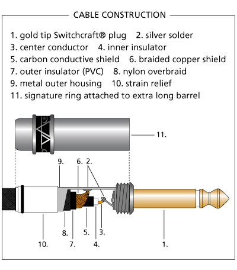
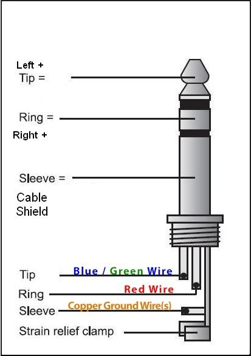
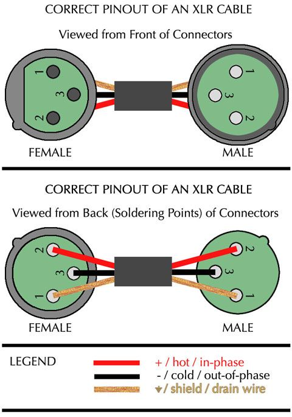
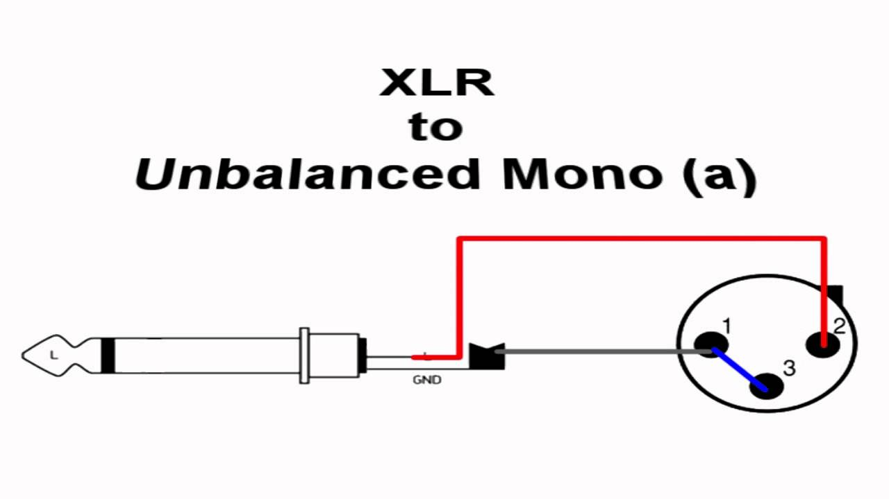
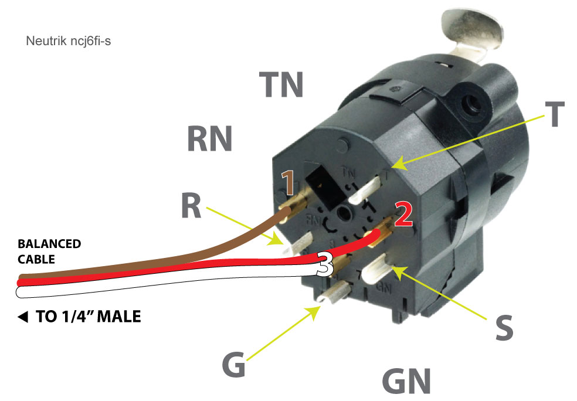
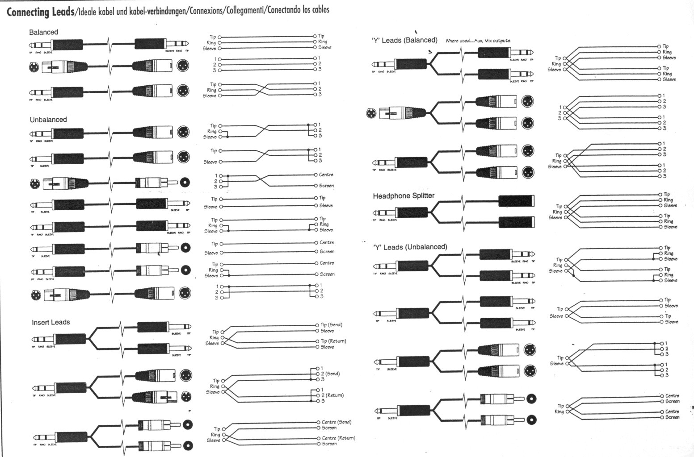

# Wiring audio cables

A cheat sheet for audio cables and plugs wiring. It can save a lot of time, searching for the right diagrams can sometimes take a while!

## Jacks

### Unbalanced mono 6.35 mm \(guitar\)

### Stereo jacks

## XLR

## XLR-Jack

### Jack mono to XLR

### Neutrik combo

## Others

